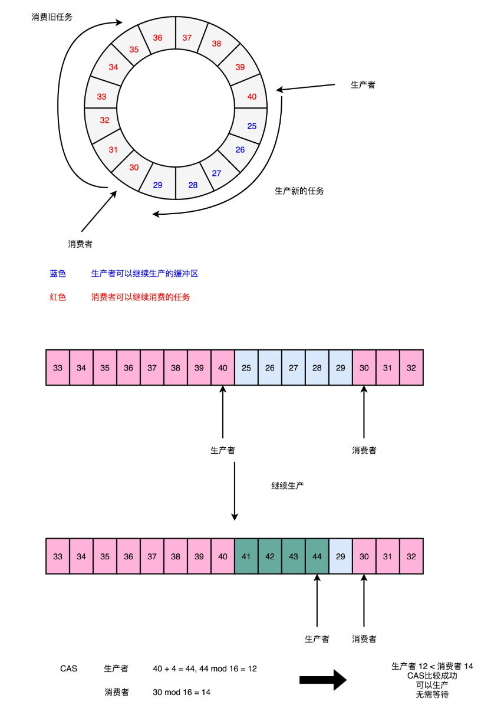
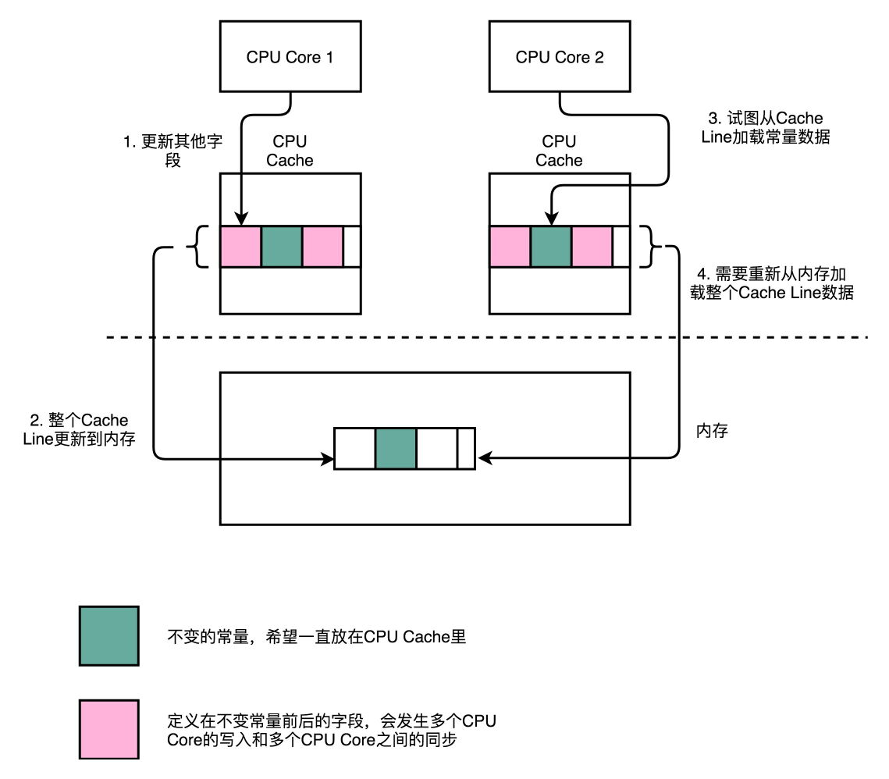
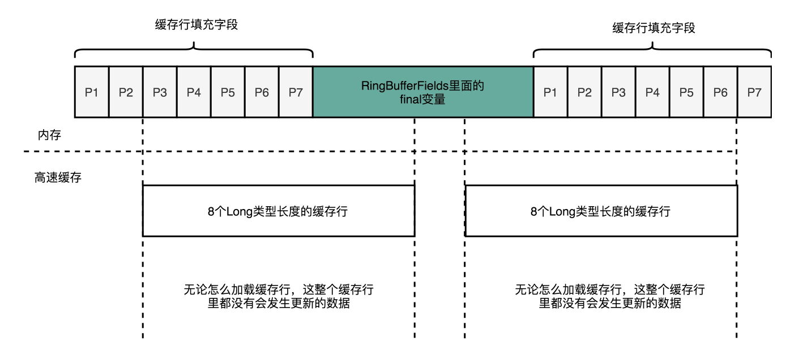

# Disruptor无锁队列
[Disruptor](https://github.com/LMAX-Exchange/disruptor)是英国外汇交易公司LMAX开发的一个高性能队列，研发的初衷是解决内部的内存队列的延迟问题  
golang中channel当遇到MPMC时，性能下降明显  
1、ringbuffer中使用cas从而实现无锁  
  
2、cacheline填充解决false-sharing的问题   
一个cacheline是64个字节, 当一个cacheline被多个cpu加载时, 为了保证数据在多核中的同步更新, 不得不把cpuCache里面的数据, 重新写回内存, 或者重新从内存中加载数据  
  
  
